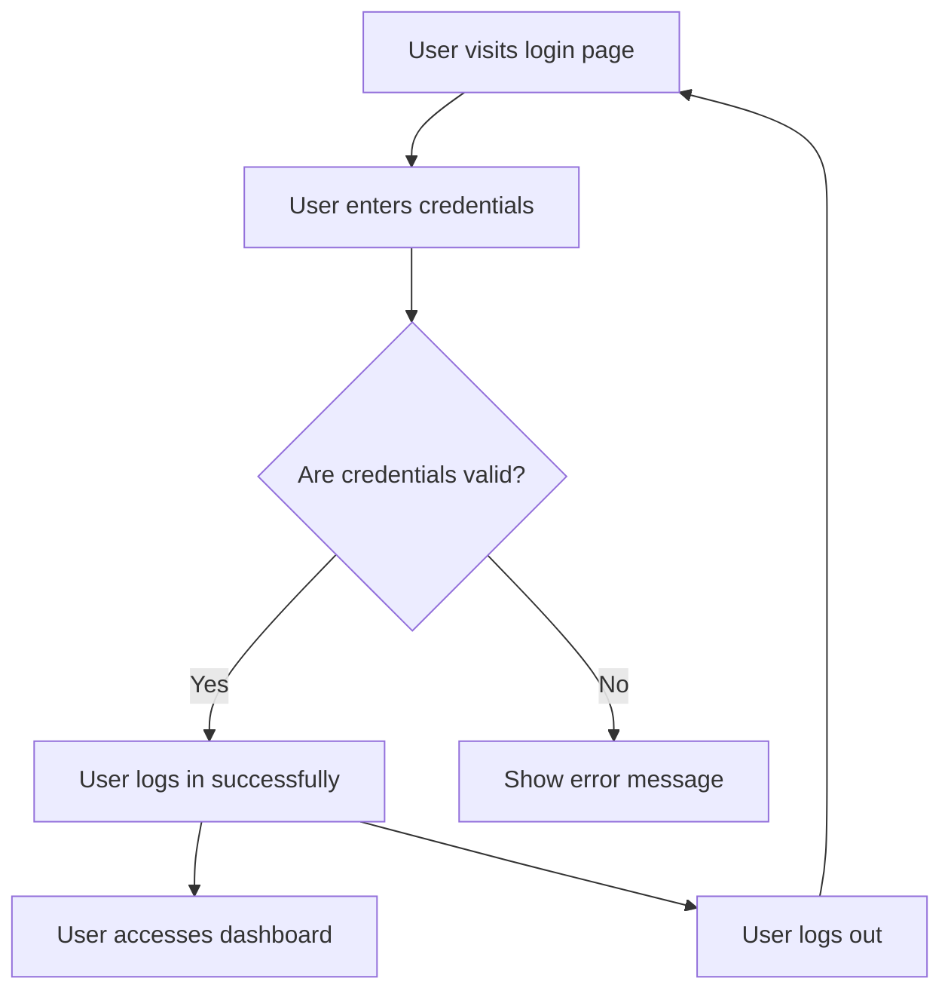
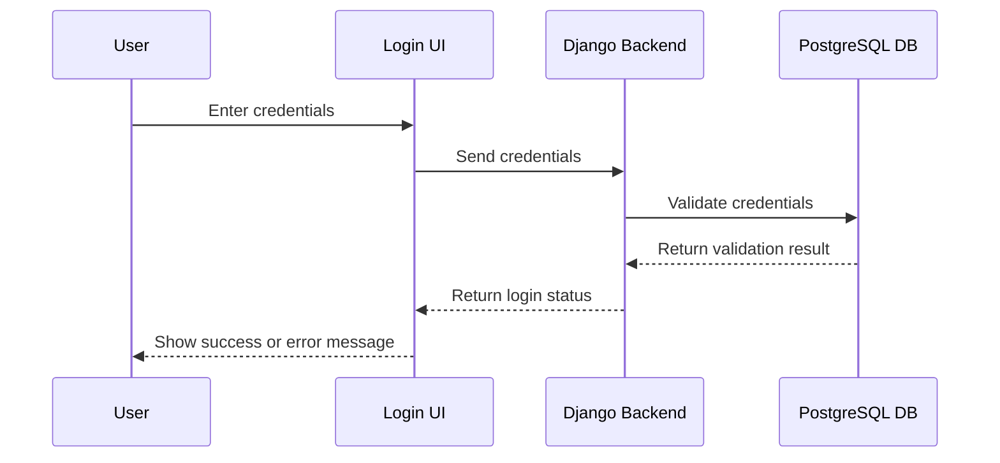

I understand that you want me to validate your requirement for creating a login feature in your UI that saves user information in a PostgreSQL database using Django. You'd like a user requirement document that includes user stories, a journey diagram, and a sequence diagram.

Here’s a simple user requirement document that we can work with:

---

# User Requirement Document for Login Feature

## User Stories

1. **As a User**, I want to create an account so that I can log in to the application.
2. **As a User**, I want to log in so that I can access my account.
3. **As a User**, I want to log out to ensure my account stays secure.
4. **As a User**, I want to recover my password in case I forget it to regain access to my account.

## User Journey Diagram

### Explanation:
This diagram shows the flow of actions when a user interacts with the login feature. It starts from the login page, goes through credential entry, and checks if the credentials are valid. Depending on the outcome, the user either logs in successfully or sees an error message.

## Sequence Diagram

### Explanation:
This sequence diagram illustrates how the login process works. The user enters their credentials in the UI, which are sent to the Django backend. The backend checks these credentials against the PostgreSQL database and returns the login status back to the UI.

---

This should give us a solid foundation to build on! If you have any adjustments or additional requirements in mind, let’s chat about them! 😊