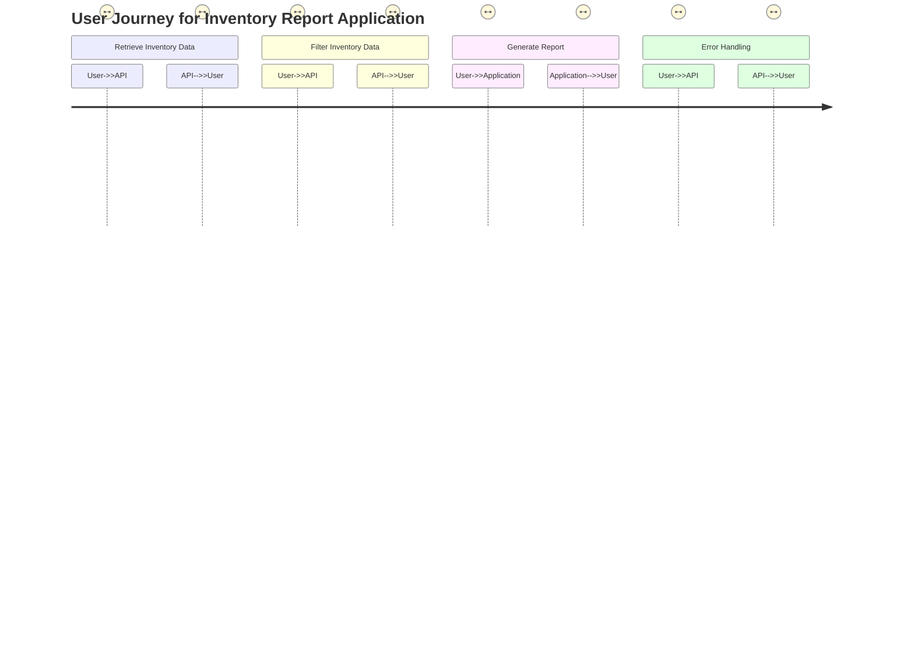
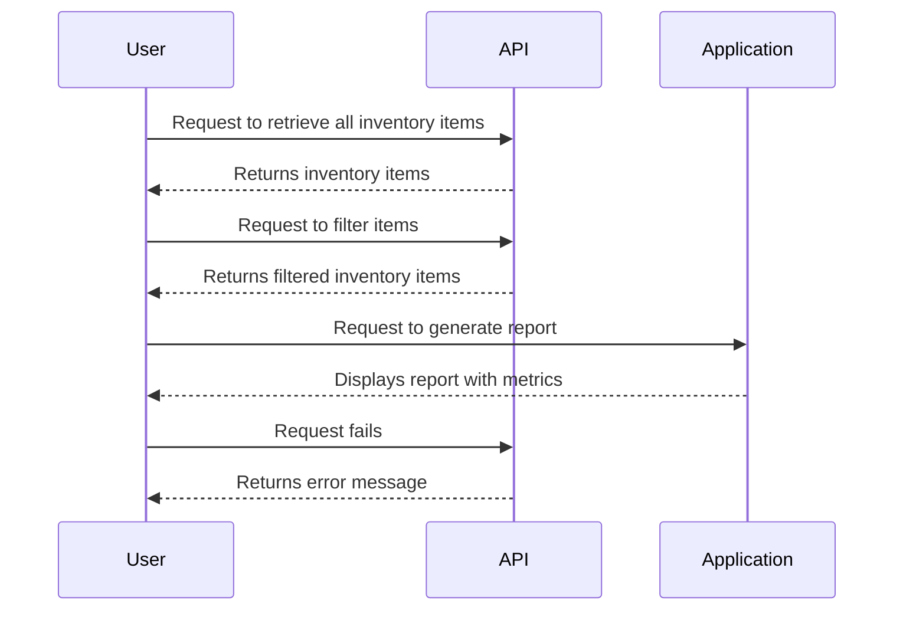

I get that you want me to validate your requirement for the inventory report application and create a user requirement document that includes user stories, a journey diagram, and a sequence diagram. You’re looking for everything to be formatted in Markdown with Mermaid diagrams, and you want it to be friendly and straightforward.

Here’s how I see your requirement:

You need an application that pulls data from the SwaggerHub API to generate reports on inventory items. The reports should display key metrics in a user-friendly way and include proper error handling.

### User Requirement Document

#### User Stories

1. **As a user**, I want to retrieve all inventory items from the API so that I can see the complete inventory list.
2. **As a user**, I want to filter inventory items based on specific criteria (like category, price range, etc.) so that I can focus on relevant data.
3. **As a user**, I want to view key metrics like total number of items, average price, and total value in the reports so that I can understand the inventory at a glance.
4. **As a user**, I want to see the reports presented in a table or chart format so that the information is easy to read.
5. **As a user**, I want to receive clear error messages if something goes wrong when retrieving data so that I know how to fix the issue.

#### User Journey Diagram

#### Sequence Diagram

### Explanation of Choices

- **User Stories**: These clearly outline what different users expect from the application, making it easier to understand their needs and priorities.
- **User Journey Diagram**: This visualizes the steps a user takes while interacting with the application, highlighting key interactions and processes.
- **Sequence Diagram**: This diagram shows the flow of data and communications between the user, API, and application, allowing us to see how actions are connected.

Everything here is designed to capture the essence of your requirements while also making it easy to convey to developers what needs to be built. If you need any adjustments or additional details, just let me know! 😊