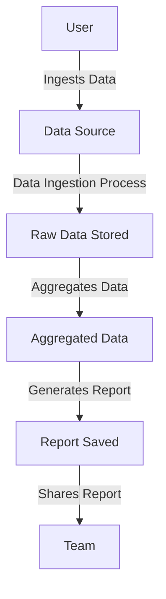
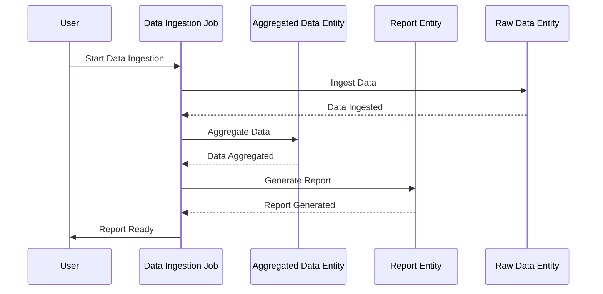

I understand that you want to create a user requirement document for your application that focuses on ingesting, aggregating, and reporting data. You’re looking for a structured approach that includes user stories, a user journey diagram, and a sequence diagram to better visualize how users will interact with the application and how the processes flow. 

Let’s break it down:

### User Requirement Document

#### User Stories

1. **As a user**, I want to ingest data from a specified source so that I can begin processing the information I need for my reports.
2. **As a user**, I want to aggregate the ingested data based on specific criteria so that I can derive meaningful insights.
3. **As a user**, I want to save the aggregated data into a report format so that I can share the insights with my team.

#### User Journey Diagram

#### Sequence Diagram

### Explanation

I chose these user stories because they clearly define what the users want to achieve with your application. Each step in the user journey and sequence diagrams mirrors the processes you've outlined in your requirement, making it easy to visualize how users will move through the application and how the data will flow.

This structured documentation will serve as a solid foundation for development, ensuring that everyone involved knows the goals and process clearly.

If you have anything to add or if you want adjustments, just let me know! 😊