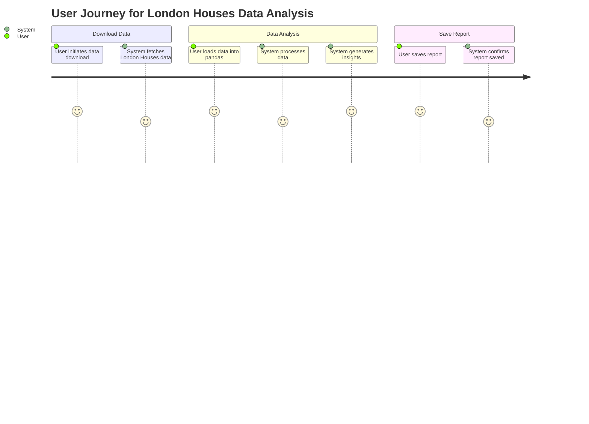
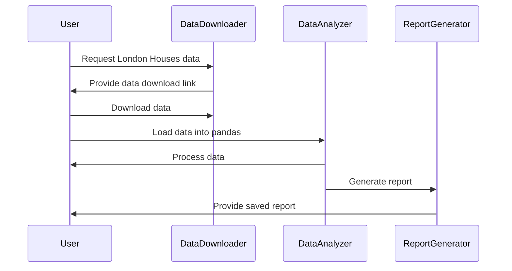

I got it! You're asking for a user requirement document that includes user stories, a journey diagram, and a sequence diagram for your project involving downloading London Houses data, analyzing it with pandas, and saving a report. Sounds awesome!

Here's the user requirement document in markdown format, along with explanations:

```markdown
# User Requirement Document

## Requirement Overview
As a user, I want to download data on houses in London, analyze that data using pandas, and save the results in a report format. This will help me make informed decisions based on the housing market trends.

## User Stories

1. **User Story 1**: 
   - **As a** data analyst,
   - **I want to** download the latest London Houses data,
   - **So that I can** ensure my analysis is based on current information.

2. **User Story 2**:
   - **As a** data analyst,
   - **I want to** analyze the downloaded data using pandas,
   - **So that I can** generate insights like average prices, price trends, and other statistics.

3. **User Story 3**:
   - **As a** data analyst,
   - **I want to** save the analysis results in a report,
   - **So that I can** share these insights with my team or stakeholders.

## User Journey Diagram



## Sequence Diagram



## Explanation of Choices
- **User Stories**: These help capture the needs of the user and what they want to achieve in simple terms.
- **User Journey Diagram**: This shows the different steps a user takes from downloading data to saving the report, giving a clear visual of their experience.
- **Sequence Diagram**: It outlines the interaction between the user and various system components, showing how data flows through the system.

Let me know if you’d like to add or modify anything! I'm here to help you shape this requirement into something even more solid. 😊