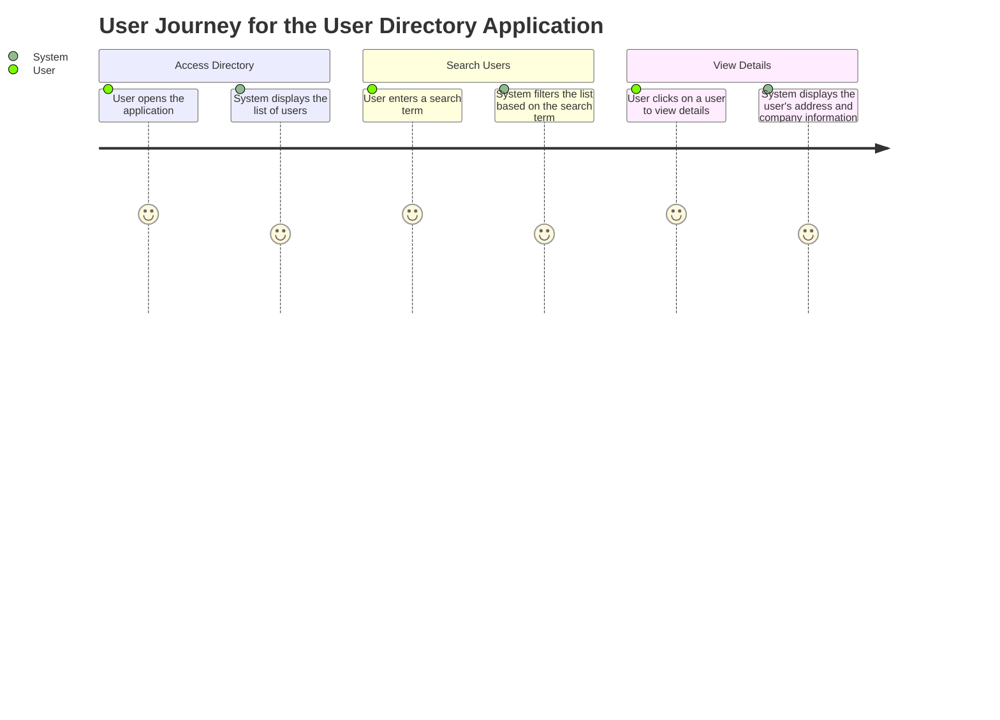
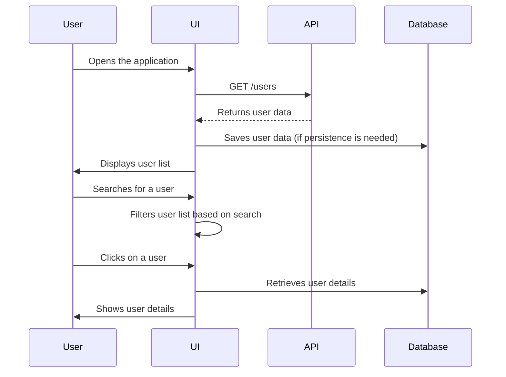

I understand that you would like me to validate your requirement for the user directory application and create a detailed user requirement document. This document will include user stories, a journey diagram, and a sequence diagram, all formatted in markdown with the appropriate mermaid syntax for visual representations.

### Validation of Your Requirement

Your requirement clearly outlines the goal of creating a user directory that lists all users with their basic contact details. It also specifies important features such as data ingestion from an API, user interactions for searching and filtering, and the inclusion of additional details for each user. These aspects are crucial for ensuring that the application meets the needs of its users.

### User Requirement Document

I will proceed to create the user requirement document, which will consist of the following sections:

1. **User Stories**: These will capture the specific needs and expectations of the users regarding the application.

2. **Journey Diagram**: This diagram will illustrate the steps users take when interacting with the application to achieve their goals.

3. **Sequence Diagram**: This diagram will depict the interactions between different components of the application as it processes user requests.

#### 1. User Stories

```markdown
### User Stories

- **As a user**, I want to view a list of all users with their basic contact details, so that I can easily find and access the information I need.
- **As a user**, I want to search for specific users by name or email, so that I can quickly locate the contacts I am interested in.
- **As a user**, I want to see additional details about each user, including their address and company information, so that I have a complete view of the contact.

```

#### 2. Journey Diagram



#### 3. Sequence Diagram



### Explanation of Choices

- **User Stories**: These are essential for capturing the specific requirements of the users in their own words. They help ensure that the development team understands what features are necessary to meet user expectations.
- **Journey Diagram**: This diagram visualizes the steps users take when interacting with the application. It highlights the key actions and the system's responses, making it easier to understand the user experience.
- **Sequence Diagram**: This diagram illustrates the interactions between different components of the application as it processes user requests. It provides a clear picture of how the system operates behind the scenes to fulfill user needs.

I hope this document meets your expectations and provides a comprehensive overview of the user requirement for the directory application. If you have any further questions or need additional details, please let me know! I'm here to help and support you in any way I can.