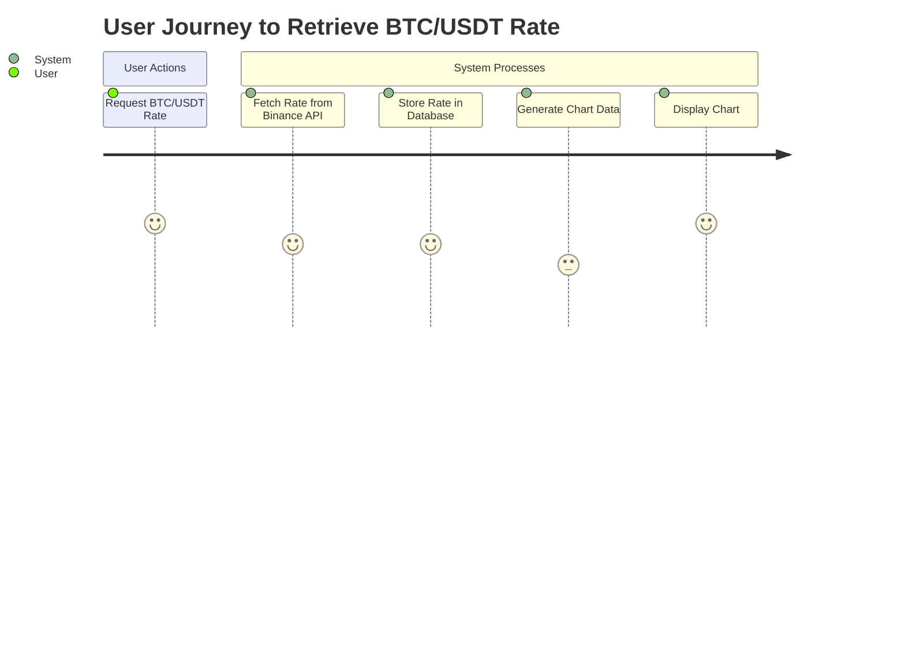
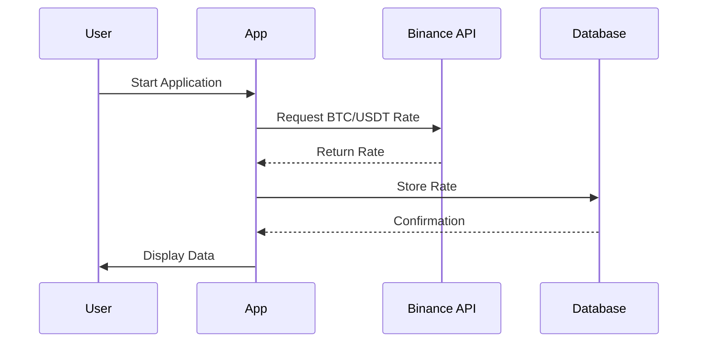

I understand that you want me to validate your requirement and create a user requirement document that includes user stories, a journey diagram, and a sequence diagram. This document will help us clearly visualize and articulate the process and interactions involved in your application that retrieves BTC/USDT rates from the Binance API.

### User Requirement Document

#### User Stories

1. **As a User**, I want to receive real-time updates of the BTC/USDT exchange rate from the Binance API every 5 seconds, so that I can monitor price fluctuations.
2. **As a User**, I want to store the retrieved exchange rates in a database, so that I can access historical data for analysis.
3. **As a User**, I want to view the stored data in a chart that displays different timeframes (5 min, 30 min, 1 day, 1 week), so that I can make informed decisions based on the trends.

#### Journey Diagram

#### Sequence Diagram

### Explanation of Choices

- **User Stories**: These capture the specific needs and expectations of the user, ensuring that we design the application with the end-user in mind.
- **Journey Diagram**: This visual representation maps out the user's journey through the process, highlighting the key interactions and stages involved in retrieving and displaying the exchange rate.
- **Sequence Diagram**: This diagram illustrates the flow of interactions between different components of the system, showing how the application communicates with the Binance API and the database to fulfill the user's request.

By including these elements in the user requirement document, we can ensure that our design is aligned with your goals and that we have a clear roadmap for implementation. If you have any further suggestions or if there's anything else you'd like to add, please let me know! I'm here to help and make this process as collaborative as possible.