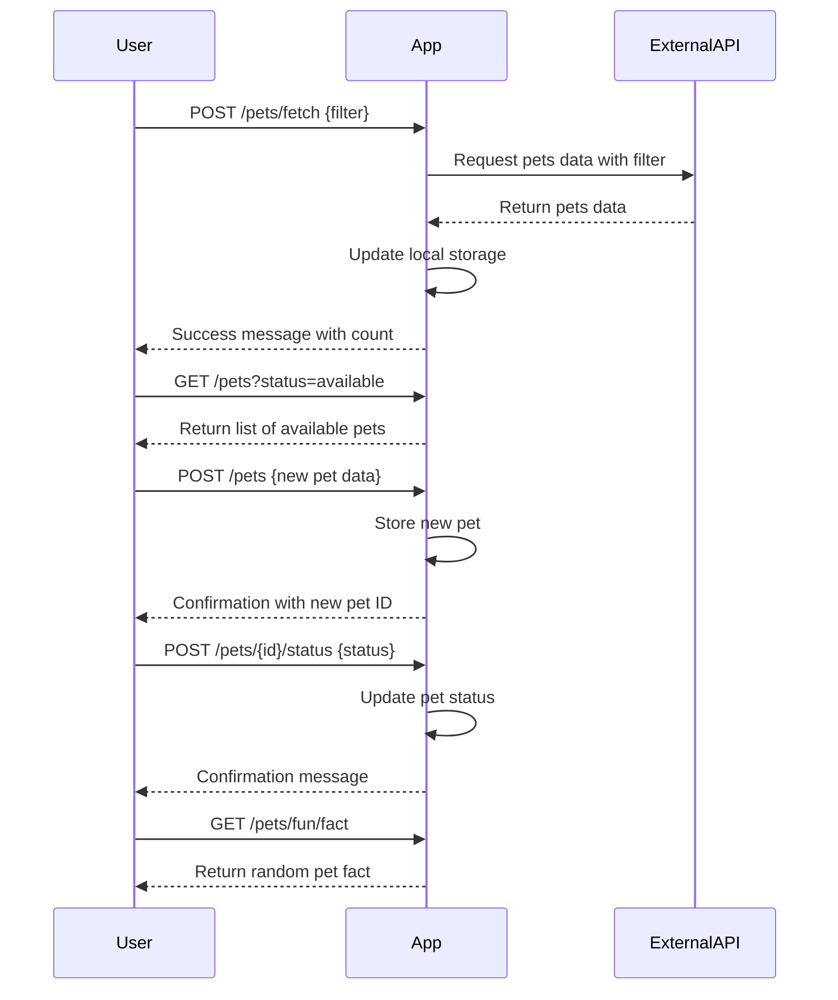

```markdown
# Purrfect Pets API - Functional Requirements

## API Endpoints

### 1. Fetch Pets Data (POST)
- **URL:** `/pets/fetch`
- **Description:** Fetches and updates local pet data from the external Petstore API.
- **Request:**
```json
{
  "filter": {
    "status": "available"  // optional: available, pending, sold
  }
}
```
- **Response:**
```json
{
  "message": "Pets data fetched and updated successfully",
  "count": 25
}
```

### 2. List Pets (GET)
- **URL:** `/pets`
- **Description:** Retrieves the list of pets stored locally, with optional filtering.
- **Query Parameters:**
  - `status` (optional): Filter by pet status.
- **Response:**
```json
[
  {
    "id": 1,
    "name": "Fluffy",
    "type": "Cat",
    "status": "available"
  },
  ...
]
```

### 3. Add New Pet (POST)
- **URL:** `/pets`
- **Description:** Adds a new pet to local storage.
- **Request:**
```json
{
  "name": "Whiskers",
  "type": "Cat",
  "status": "available"
}
```
- **Response:**
```json
{
  "id": 26,
  "message": "New pet added successfully"
}
```

### 4. Update Pet Status (POST)
- **URL:** `/pets/{id}/status`
- **Description:** Updates the status of a given pet.
- **Request:**
```json
{
  "status": "sold"
}
```
- **Response:**
```json
{
  "id": 1,
  "message": "Pet status updated successfully"
}
```

### 5. Fun Feature: Random Pet Fact (GET)
- **URL:** `/pets/fun/fact`
- **Description:** Retrieves a random pet fact.
- **Response:**
```json
{
  "fact": "Cats sleep for 70% of their lives."
}
```

---

## User-App Interaction Sequence


```