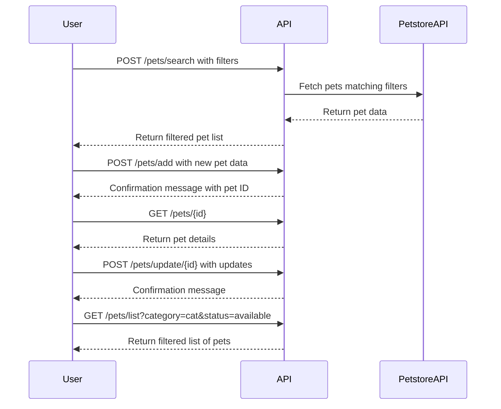

```markdown
# Functional Requirements for Purrfect Pets API

## API Endpoints

### 1. POST /pets/search
- **Purpose**: Search pets using filters, invoking external Petstore API.
- **Request Body** (JSON):
  ```json
  {
    "category": "string",       // optional, e.g., "cat", "dog"
    "status": "string",         // optional, e.g., "available", "sold", "pending"
    "name": "string"            // optional, partial or full pet name
  }
  ```
- **Response** (JSON):
  ```json
  {
    "pets": [
      {
        "id": "number",
        "name": "string",
        "category": "string",
        "status": "string",
        "photoUrls": ["string"],
        "tags": ["string"]
      },
      ...
    ]
  }
  ```

### 2. POST /pets/add
- **Purpose**: Add a new pet (business logic applies before saving).
- **Request Body** (JSON):
  ```json
  {
    "name": "string",
    "category": "string",
    "status": "string",
    "photoUrls": ["string"],
    "tags": ["string"]
  }
  ```
- **Response** (JSON):
  ```json
  {
    "id": "number",
    "message": "Pet added successfully"
  }
  ```

### 3. GET /pets/{id}
- **Purpose**: Retrieve pet details by ID from the local app database.
- **Response** (JSON):
  ```json
  {
    "id": "number",
    "name": "string",
    "category": "string",
    "status": "string",
    "photoUrls": ["string"],
    "tags": ["string"]
  }
  ```

### 4. POST /pets/update/{id}
- **Purpose**: Update pet data.
- **Request Body** (JSON):
  ```json
  {
    "name": "string",            // optional
    "category": "string",        // optional
    "status": "string",          // optional
    "photoUrls": ["string"],     // optional
    "tags": ["string"]           // optional
  }
  ```
- **Response** (JSON):
  ```json
  {
    "message": "Pet updated successfully"
  }
  ```

### 5. GET /pets/list
- **Purpose**: Retrieve all pets or filtered by query params (category/status).
- **Query Parameters**:
  - category (optional)
  - status (optional)
- **Response** (JSON):
  ```json
  {
    "pets": [ { ...pet details... }, ... ]
  }
  ```

---

## User-App Interaction Sequence Diagram



---

## Example Request/Response for POST /pets/search

**Request:**
```json
{
  "category": "cat",
  "status": "available"
}
```

**Response:**
```json
{
  "pets": [
    {
      "id": 123,
      "name": "Whiskers",
      "category": "cat",
      "status": "available",
      "photoUrls": ["http://example.com/photos/whiskers.jpg"],
      "tags": ["friendly", "small"]
    }
  ]
}
```
```