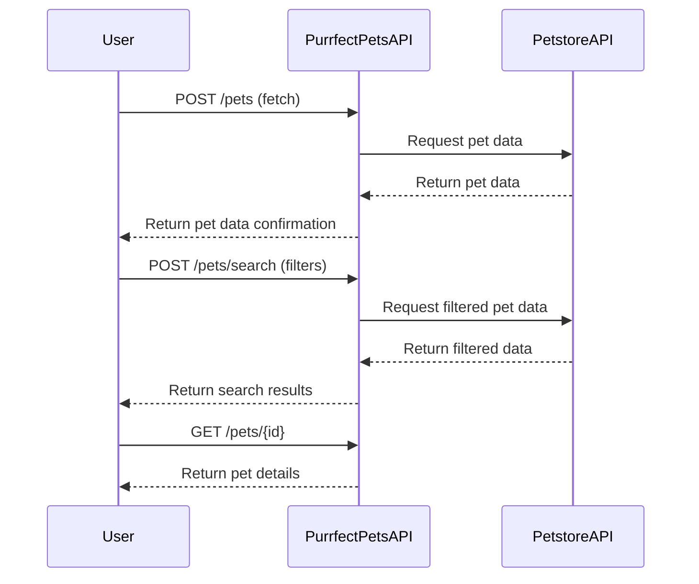
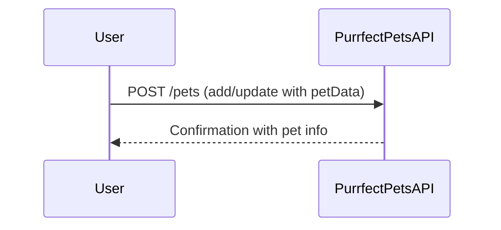

```markdown
# Functional Requirements for Purrfect Pets API

## API Endpoints

### 1. Add or Update Pet Data (POST /pets)
- **Description:** Fetches pet data from external Petstore API or adds/updates local pet info with business logic.
- **Request:**
```json
{
  "action": "fetch" | "add" | "update",
  "petData": {
    "id": "optional for add",
    "name": "string",
    "category": "string",
    "status": "available" | "pending" | "sold",
    "tags": ["string"]
  }
}
```
- **Response:**
```json
{
  "success": true,
  "pet": {
    "id": "string",
    "name": "string",
    "category": "string",
    "status": "string",
    "tags": ["string"]
  }
}
```

### 2. Search Pets (POST /pets/search)
- **Description:** Searches pets based on filters by invoking external data and applying business logic.
- **Request:**
```json
{
  "filters": {
    "category": "string (optional)",
    "status": "string (optional)",
    "name": "string (optional)"
  }
}
```
- **Response:**
```json
{
  "pets": [
    {
      "id": "string",
      "name": "string",
      "category": "string",
      "status": "string",
      "tags": ["string"]
    }
  ]
}
```

### 3. Get Pet Details (GET /pets/{id})
- **Description:** Retrieves stored pet information by ID.
- **Response:**
```json
{
  "id": "string",
  "name": "string",
  "category": "string",
  "status": "string",
  "tags": ["string"]
}
```

---

## User-App Interaction Sequence



---

## Alternative User Journey - Add or Update Pet Locally


```